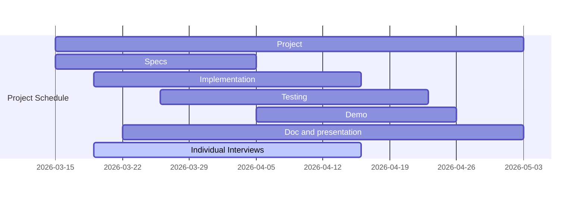

# Introduction To Robotics 2026 Project Template

## Goal

Implement an autonomous behavior for the Create3 robot.

### Minimum Requirements

- The robot shall 
    - undock
    - navigate in the class for "some" time
    - find its way back and dock
- At every moment when undocked, one shall be able to stop the robot and take back manual control 

## Team Specific Requirements

Examples (non exhaustive list)
- Non-trivial Behavior (chasing, patrolling, interaction protocol, etc)
- Robust navigation (obstacle avoidance, driving out of a dead end) skills
- Mapping: produce some map of the robot expedition
- Extending capabilities: vision (phone), audio (microphone), etc

## Tasks

- [ ] Specifications: write down expected features and behaviors 
- [ ] Implementation
- [ ] Testing: design simple scenarios testing individual or intermediate features
    - [ ] Test1 (example): test FSM on turtlesim
    - [ ] Test2 (example): test robot avoiding chair 
    - [ ] etc
- [ ] Demo
- [ ] Documentation and presentation

## Tentative Planning

## Organization

Work in team:
- Assign roles and tasks 
    - project manager
    - code review 
    - tester 
    - documenter 
    - etc
- Communicate 
    - Progress reports
    - Directions

